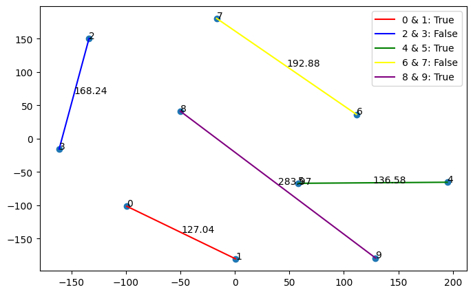

# GenAI4SE: Take Home Assignment

## Personal Information:
<b> Name: </b> Subodh Gujar  
<b> Unity ID: </b> sgujar  
<b> Email: </b> sgujar@ncsu.edu  

## Objective

1. Sample 10 code snippets from the task Code Clone Detection from the benchmark
CodeXGlue.  

2. Implement code for collecting the code embedding from an existing model CodeBERT
published on Hugging Face.  

3. Visualize the embedding by using TSNE technique in the library SciKit-Learn.  

4. Observe the result and summarize your findings (such as “Code X and Y are close to
each other in the vector space because they are sematically equivlant.“).  

## Results

## Observations

1. Some points, like 0, 1, 4, and 5, are shown close together because they are syntactically similar in how they are written, therefore marked as "True." However, points 8 and 9 are far apart even though they are also marked as "True." This difference in distance might happen because when we truncate the code into pieces, we can only use a limited length of 512 characters. So, if there's more code than that, some parts might get cut off.  

2. We can see that some points, like 2 and 3, seem close together on the graph even though they are marked as "False." This can also be because of the maximum length  during code tokenization. Sometimes, the beginning of two pieces of code might look similar, but the part that makes them different could be left out because it's too long, making them seem similar when they are not.  

## Running the Code

1. Open the assignment.ipynb. (First line contains code to install all required libraries).  
2. Run the cells in order  
3. The output graph will be plotted in last python cell.  

